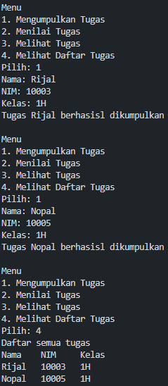
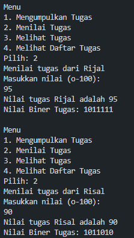
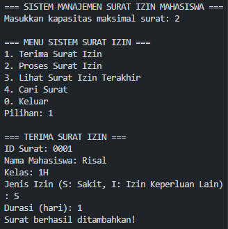
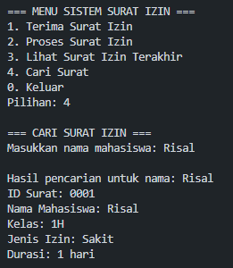
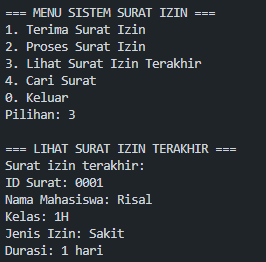
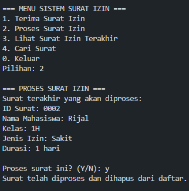

|  | Algoritma dan Struktur Data |
|--|--|
| NIM |  244107020240|
| Nama | Mochammad Rijal Dzaki Rifki Afifudin |
| Kelas | TI - 1H |
| Repository | [Zinc-zn](https://github.com/Zinc-zn/14_ALSD) |

# Stack

## 8 Praktikum

### 8.2 Mahasiswa Mengumpulkan Tugas

#### 8.2.1 Langkah Percobaan
Setelah melakukan langkah percobaan sesuai dengan petunjuk yang diberikan, dihasilkan 3 file, yaitu [Mahasiswa14.java](./Mahasiswa14.java), [MahasiswaDemo14.java](./MahasiswaDemo14.java), dan [StackTugasMahasiswa14.java](./StackTugasMahasiswa14.java)

#### 8.2.2 Verifikasi Percobaan



#### 8.2.3 Jawaban Pertanyaan

1. Modifikasi looping for pada method print :
```
for (int i = top; i >= 0; i--)
```
2. Berdasarkan kode program
```StackTugasMahasiswa14 stack = new StackTugasMahasiswa14(5);``` stack dapat menampung 5 data tugas mahasiswa.
3. Method **push()** perlu melakukan pengecekan kondisi **isFull()** untuk memastikan bahwa Stack tidak melebihi kapasitas maksimumnya. Dalam implementasi array, Stack memiliki ukuran tetap sehingga tidak bisa menambahkan elemen jika sudah penuh.
4. Menambahkan method pada class [StackTugasMahasiswa14.java](./StackTugasMahasiswa14.java) :
```
public Mahasiswa14 peekBottom() {
    if (!isEmpty()) {
        return stack[0];
    } else {
        System.out.println("Stack kosong! Tidak ada tugas yang dikumpulkan");
        return null;
    }
}
``` 
Dan modifikasi class [MahasiswaDemo14.java](./MahasiswaDemo14.java) :

Add Case :
```
case 5:
    Mahasiswa14 pertama = stack.peekBottom();
    if (pertama != null) {
        System.out.println("Tugas pertama dikumpulkan oleh " + pertama.nama);
    }
    break;
```
Menu :
```
System.out.println("5. Melihat Tugas Pertama");
```
Kondisi Loop :
```
} while (pilih >= 1 && pilih <= 5);
```
5. Menambahkan method count() pada class [StackTugasMahasiswa14.java](./StackTugasMahasiswa14.java) :
```
public int count() {
    return top + 1;
}
```
Dan menambahkan opsi menu pada class [MahasiswaDemo14.java](./MahasiswaDemo14.java) :
```
System.out.println("6. Menghitung Jumlah Tugas");
```
```
case 6:
    int jumlahTugas = stack.count();
    System.out.println("Jumlah tugas yang sudah dikumpulkan: " + jumlahTugas);
    break;
```
```
} while (pilih >= 1 && pilih <= 6);
```


### 8.3 Konversi Nilai Tugas Ke Biner

#### 8.3.1 Langkah Percobaan
Setelah melakukan langkah percobaan sesuai dengan petunjuk yang diberikan, dihasilkan 1 file, yaitu [StackKonversi14.java](./StackKonversi14.java)

#### 8.3.2 Verifikasi Percobaan


#### 8.3.3 Jawaban Pertanyaan

1. - Method menerima parameter input berupa nilai desimal (int).
   - Membuat objek StackKonversi14 untuk menyimpan sisa hasil bagi.
   - Melakukan iterasi selama nilai > 0
   - Membuat String kosong untuk menyimpan hasil biner.
   - Melakukan iterasi untuk mengambil semua nilai dari stack sampai kosong.
   - Mengembalikan String hasil biner.

2. Modifikasi method ***KonversiDesimalKeBiner*** :
```
public String konversiDesimalKeBiner(int nilai) {
    StackKonversi14 stack = new StackKonversi14();
    while (nilai != 0) {
        int sisa = nilai % 2;
        stack.push(sisa);
        nilai = nilai / 2;
    }
    String biner = new String();
    while (!stack.isEmpty()) {
        biner += stack.pop();
    }
    return biner;
}
```
**Analisis perubahan:**

- Kasus nilai positif: Tidak ada perbedaan untuk nilai positif. Loop akan berjalan hingga nilai menjadi 0, sama seperti sebelumnya.
- Kasus nilai 0: Dengan kondisi while (nilai > 0), jika input adalah 0, loop tidak akan dieksekusi sama sekali dan fungsi akan mengembalikan string kosong. Dengan kondisi while (nilai != 0), hasilnya sama karena 0 != 0 adalah false.


### 8.5 Latihan Praktikum
Program di implementasikan pada 2 class, yaitu :   
 [Surat14.java](./Surat14.java), [StackSurat14.java](./StackSurat14.java), 







