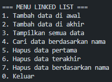

|  | Algoritma dan Struktur Data |
|--|--|
| NIM |  244107020240|
| Nama | Mochammad Rijal Dzaki Rifki Afifudin |
| Kelas | TI - 1H |
| Repository | [Zinc-zn](https://github.com/Zinc-zn/14_ALSD) |

# Linked List

## 10 Praktikum

### 10.1 Pembuatan Single Linked List

#### 10.1.1 Langkah Percobaan
Setelah melakukan langkah percobaan sesuai dengan petunjuk yang diberikan, dihasilkan 4 file, yaitu [Mahasiswa14.java](./Mahasiswa14.java), [NodeMahasiswa14.java](./NodeMahasiswa14.java), [SigleLinkedList14.java](./SingleLinkedList14.java), [SLLMain14.java](./SLLMain14.java).

#### 10.1.3 Verifikasi Percobaan


#### 10.1.3 Jawaban Pertanyaan

1. Method print() mendeteksi list kosong: Method ini memeriksa kondisi isEmpty() dan menampilkan pesan "Linked list kosong" jika head == null.

2. Variable temp (temporary) digunakan sebagai pointer traversal dengan fungsi:

- Navigasi: Bergerak melalui linked list dari node ke node.
- Pencarian: Mencari node dengan kriteria tertentu tanpa mengubah pointer head.
- Operasi aman: Melakukan operasi tanpa merusak struktur asli linked list.
- Referensi sementara: Menyimpan referensi node untuk operasi insert/delete.

3. Modifikasi [SLLMain14.java](./SLLMain14.java) :
```
    import java.util.Scanner;

public class SLLMain14 {

    public static void main(String[] args) {
        Scanner scanner = new Scanner(System.in);
        SingleLinkedList14 sll = new SingleLinkedList14();
        
        int pilihan;
        
        do {
            System.out.println("\n=== MENU LINKED LIST ===");
            System.out.println("1. Tambah data di awal");
            System.out.println("2. Tambah data di akhir");
            System.out.println("3. Tampilkan semua data");
            System.out.println("4. Cari data berdasarkan nama");
            System.out.println("5. Hapus data pertama");
            System.out.println("6. Hapus data terakhir");
            System.out.println("7. Hapus data berdasarkan nama");
            System.out.println("0. Keluar");
            System.out.print("Pilih menu: ");
            pilihan = scanner.nextInt();
            scanner.nextLine();
            
            switch (pilihan) {
                case 1:
                    System.out.println("\n--- Tambah Data di Awal ---");
                    Mahasiswa14 mhsFirst = inputMahasiswa(scanner);
                    sll.addFirst(mhsFirst);
                    System.out.println("Data berhasil ditambahkan di awal!");
                    break;
                    
                case 2:
                    System.out.println("\n--- Tambah Data di Akhir ---");
                    Mahasiswa14 mhsLast = inputMahasiswa(scanner);
                    sll.addLast(mhsLast);
                    System.out.println("Data berhasil ditambahkan di akhir!");
                    break;
                    
                case 3:
                    System.out.println("\n--- Tampilkan Semua Data ---");
                    sll.print();
                    break;
                    
                case 4:
                    System.out.print("Masukkan nama yang dicari: ");
                    String namaCari = scanner.nextLine();
                    int index = sll.indexOf(namaCari);
                    if (index != -1) {
                        System.out.println("Data mahasiswa atas nama " + namaCari + 
                                         " berada pada index: " + index);
                        System.out.println("Data pada index " + index + ":");
                        sll.getData(index);
                    } else {
                        System.out.println("Data tidak ditemukan!");
                    }
                    break;
                    
                case 5:
                    System.out.println("\n--- Hapus Data Pertama ---");
                    sll.removeFirst();
                    System.out.println("Data pertama berhasil dihapus!");
                    break;
                    
                case 6:
                    System.out.println("\n--- Hapus Data Terakhir ---");
                    sll.removeLast();
                    System.out.println("Data terakhir berhasil dihapus!");
                    break;
                    
                case 7:
                    System.out.print("Masukkan nama yang akan dihapus: ");
                    String namaHapus = scanner.nextLine();
                    sll.remove(namaHapus);
                    System.out.println("Data berhasil dihapus!");
                    break;
                    
                case 0:
                    System.out.println("Terima kasih!");
                    break;
                    
                default:
                    System.out.println("Pilihan tidak valid!");
            }
        } while (pilihan != 0);
        
        scanner.close();
    }
    
    public static Mahasiswa14 inputMahasiswa(Scanner scanner) {
        System.out.print("Masukkan NIM: ");
        String nim = scanner.nextLine();
        
        System.out.print("Masukkan Nama: ");
        String nama = scanner.nextLine();
        
        System.out.print("Masukkan Kelas: ");
        String kelas = scanner.nextLine();
        
        System.out.print("Masukkan IPK: ");
        double ipk = scanner.nextDouble();
        scanner.nextLine();
        
        return new Mahasiswa14(nim, nama, kelas, ipk);
    }
}
```

Hasil Program :

tampilan menu :

Menu 1 :

Menu 2 :

Menu 3 :

Menu 4 :

Menu 5 :

Menu 6 :

Menu 7 :


### 10.2 Modifikasi Elemen pada Single Linked List

#### 10.2.1 Langkah Percobaan
Setelah melakukan langkah percobaan sesuai dengan petunjuk yang diberikan, modifikasi 4 file, yaitu [Mahasiswa14.java](./Mahasiswa14.java), [NodeMahasiswa14.java](./NodeMahasiswa14.java), [SigleLinkedList14.java](./SingleLinkedList14.java), [SLLMain14.java](./SLLMain14.java)


#### 10.2.2 Verifikasi Percobaan


#### 10.2.3 Jawaban Pertanyaan
1. Keyword break digunakan dalam fungsi remove() untuk menghentikan loop setelah elemen yang dicari ditemukan dan dihapus.
2. Kode ini memastikan bahwa setelah penghapusan, struktur linked list tetap konsisten dan semua pointer (head, tail) menunjuk ke lokasi yang benar.


### 10.3 Tugas
Program di implementasikan pada folder tugas dan terdapat 4 class, yaitu :   
 [Mahasiswa14.java](./tugas/Mahasiswa14.java), [MainAntrianKemahasiswaan14.java](./tugas/MainAntrianKemahasiswaan14.java), [NodeMahasiswa14.java](./tugas/NodeMahasiswa14.java) dan [QueueMahasiswa14.java](./tugas/QueueMahasiswa14.java) .


