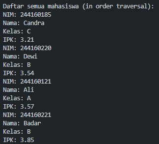
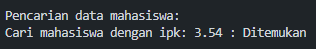
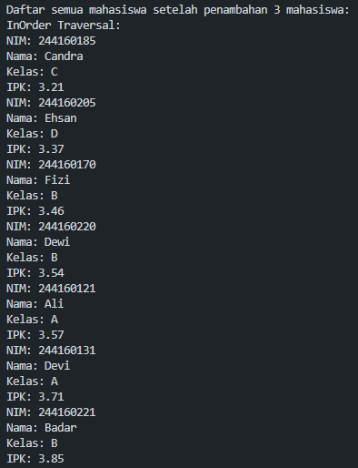
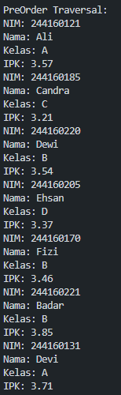
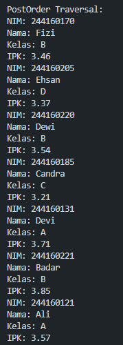
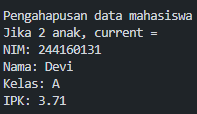
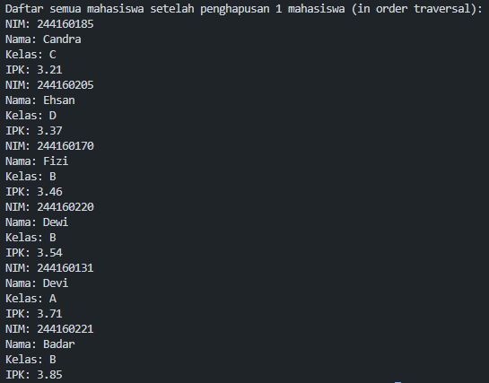
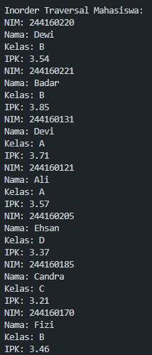
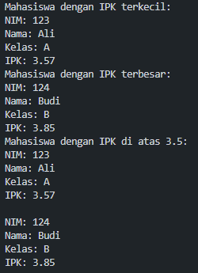
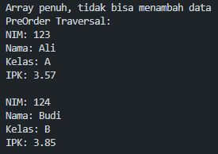

|  | Algoritma dan Struktur Data |
|--|--|
| NIM |  244127020240|
| Nama | Mochammad Rijal Dzaki Rifki Afifudin |
| Kelas | TI - 1H |
| Repository | [Zinc-zn](https://github.com/Zinc-zn/14_ALSD) |

# Tree

## 12 Praktikum

### 12.1 Percobaan 1

#### 12.1.1 Langkah Percobaan
Setelah melakukan langkah percobaan sesuai dengan petunjuk yang diberikan, dihasilkan 4 file, yaitu [Mahasiswa14.java](./Mahasiswa14.java), [Node14.java](./Node14.java), [BinaryTree14.java](./BinaryTree14.java), [BinaryTreeMain14.java](./BinaryTreeMain14.java).

#### 12.1.2 Verifikasi Percobaan










#### 12.1.3 Jawaban Pertanyaan

1. Binary Search Tree (BST) lebih efektif karena memiliki struktur yang teratur dimana:

- Node kiri selalu memiliki nilai lebih kecil dari parent.
- Node kanan selalu memiliki nilai lebih besar dari parent.

2. Atribut left dan right berfungsi sebagai pointer/referensi yang menunjuk ke:

- left: Node anak kiri (berisi data dengan nilai lebih kecil).
- right: Node anak kanan (berisi data dengan nilai lebih besar).

3. Atribut root adalah titik awal/entry point dari seluruh struktur BST. Semua operasi (insert, search, delete, traversal) dimulai dari root. Ketika tree pertama kali dibuat, nilai root = null menandakan tree masih kosong.

4. Ketika tree masih kosong dan akan ditambahkan node baru:

- Method isEmpty() mengecek apakah root == null.
- Jika kosong, node baru langsung dijadikan sebagai root.
- Node baru menjadi akar dari tree yang baru terbentuk.

5. Analisis Method add():

```
    public void add(Mahasiswa14 mahasiswa) {
    Node14 newNode = new Node14(mahasiswa);  // Buat node baru
    
    if (isEmpty()) {
        root = newNode;  // Jika tree kosong, jadikan root
    } else {
        Node14 current = root;     // Mulai dari root
        Node14 parent = null;      // Tracker untuk parent node
        
        while (true) {
            parent = current;      // Simpan posisi current sebagai parent
            
            // BAGIAN YANG PERLU DIPERBAIKI:
            if (mahasiswa.ipk < current.mahasiswa.ipk) {
                current = current.left;    // Gerak ke kiri
                if (current == null) {
                    parent.left = newNode; // Insert di kiri parent
                    return;
                }
            } else {
                current = current.right;   // Gerak ke kanan
                if (current == null) {
                    parent.right = newNode; // Insert di kanan parent
                    return;
                }
            }
        }
    }
}

```

Penjelasan Alur:

parent = current; 
   - Sebelum current bergerak, posisinya disimpan di parent
   
if (mahasiswa.ipk < current.mahasiswa.ipk)
   - Bandingkan IPK mahasiswa baru dengan current node
   
current = current.left; atau current = current.right;
   - current bergerak ke anak kiri/kanan
   
if (current == null) 
   - Jika mencapai ujung (null), artinya tempat insert ditemukan
   
parent.left = newNode; atau parent.right = newNode;
   - Insert node baru sebagai anak dari parent
   
Mengapa perlu parent?
- Karena ketika current == null, kita kehilangan referensi ke node terakhir
- parent menyimpan posisi node terakhir yang valid untuk proses insert

6. Method getSuccessor() membantu dalam menghapus node yang memiliki dua anak dengan cara:
Langkah-langkah:

- Cari successor: Node terkecil di subtree kanan (atau terbesar di subtree kiri)
- Pindahkan successor ke posisi node yang akan dihapus
- Atur ulang pointer untuk menjaga struktur BST

Mengapa successor?

- Successor adalah node yang nilainya tepat lebih besar dari node yang dihapus
- Mengganti dengan successor memastikan properti BST tetap terjaga
- Successor pasti tidak memiliki anak kiri (karena dia adalah nilai terkecil di subtree kanan)

Contoh: Jika menghapus node dengan IPK 3.57 yang memiliki dua anak, successor akan dicari di subtree kanan dan dipindahkan ke posisi node yang dihapus.
Proses ini memastikan bahwa setelah penghapusan, struktur BST tetap valid dengan semua node kiri < parent < semua node kanan.

### 12.2 Percobaan 2
#### 12.2.1 Langkah Percobaan
Setelah melakukan langkah percobaan sesuai dengan petunjuk yang diberikan, dihasilkan 2 file, yaitu [BinaryTreeArray14.java](./BinaryTreeArray14.java), [BinaryTreeArrayMain14.java](./BinaryTreeArrayMain14.java).

#### 12.2.2 Verifikasi Percobaan




#### 12.2.3 Jawaban Pertanyaan
1. 
- `dataMahasiswa`: Array yang menyimpan semua data mahasiswa dalam struktur binary tree
- `idxLast`: Indeks terakhir yang berisi data valid dalam array (menandakan batas data yang terisi)
2. Method `populateData()` berfungsi untuk:

- Mengisi array dataMahasiswa dengan data yang sudah disiapkan
- Mengatur nilai idxLast untuk menandai posisi terakhir data valid
- Inisialisasi data sebelum operasi traversal dilakukan

3. Method `traverseInOrder()` melakukan traversal In-Order pada binary tree yang disimpan dalam array:

- Mengunjungi subtree kiri → node current → subtree kanan
- Menampilkan data mahasiswa dalam urutan tertentu
- Menggunakan rekursi untuk mengakses seluruh node

4. Jika suatu node berada di indeks `k`, maka:

- Left child: `2*k + 1`
- Right child: `2*k + 2`
- Parent: `(k-1)/2`

5.  Visualisasi Binary Tree dengan Array (idxLast = 6)

Pemetaan Array ke Binary Tree:

```
Array: [mhs1, mhs2, mhs3, mhs4, mhs5, mhs6, mhs7, null, null, null]
Index:  [0,    1,    2,    3,    4,    5,    6,    7,    8,    9   ]
```

Struktur Tree yang Terbentuk:

```
                mhs1 (idx=0)
               /            \
        mhs2 (idx=1)    mhs3 (idx=2)
        /         \         /         \
   mhs4(idx=3) mhs5(idx=4) mhs6(idx=5) mhs7(idx=6)
```

Penjelasan Posisi Node:

- **Root**: mhs1 (indeks 0)
- **Level 1**: mhs2 (indeks 1), mhs3 (indeks 2)  
- **Level 2**: mhs4 (indeks 3), mhs5 (indeks 4), mhs6 (indeks 5), mhs7 (indeks 6)

Perhitungan Child Nodes:

Untuk setiap node di indeks `i`:
- **Left child**: `2*i + 1`
- **Right child**: `2*i + 2`

Contoh:
- mhs1 (idx=0): left=1, right=2
- mhs2 (idx=1): left=3, right=4  
- mhs3 (idx=2): left=5, right=6

Traversal In-Order:

Urutan kunjungan: **Left → Root → Right**

1. mhs4 (idx=3)
2. mhs2 (idx=1) 
3. mhs5 (idx=4)
4. mhs1 (idx=0)
5. mhs6 (idx=5)
6. mhs3 (idx=2)
7. mhs7 (idx=6)


6. Penjelasan:

- `2*idxStart+1`: Mengakses left child dari node di posisi `idxStart`
- `2*idxStart+2`: Mengakses right child dari node di posisi `idxStart`

Kaitannya dengan struktur pohon biner:

- Root selalu di indeks 0
- Level pertama dimulai dari indeks 1 dan 2
- Level kedua dimulai dari indeks 3, 4, 5, 6
- Dst.

Contoh perhitungan:

- Node di indeks 0: left child = 20+1 = 1, right child = 20+2 = 2
- Node di indeks 1: left child = 21+1 = 3, right child = 21+2 = 4
- Node di indeks 2: left child = 22+1 = 5, right child = 22+2 = 6


### 12.3 Tugas
Modifikasi program sebelumnya (percobaan 1 & percobaan 2), berikut adalah hasilnya :




#### 12.3.1 Penjelasan Tugas
1. Method addRekursif() untuk BinaryTree14
Method ini menggunakan pendekatan rekursif untuk menambahkan node baru ke BST:

    Base case: Jika node null, buat node baru
    Recursive case: Bandingkan IPK dan panggil rekursif ke kiri/kanan
    Menggunakan helper method untuk mempertahankan struktur tree

2. Method cariMinIPK() untuk BinaryTree14
Memanfaatkan sifat BST dimana nilai terkecil selalu berada di subtree kiri paling ujung:

    Traverse terus ke kiri hingga mencapai node yang tidak memiliki anak kiri
    Node tersebut adalah nilai minimum

3. Method cariMaxIPK() untuk BinaryTree14
Kebalikan dari cariMinIPK, nilai terbesar selalu berada di subtree kanan paling ujung:

    Traverse terus ke kanan hingga mencapai node yang tidak memiliki anak kanan
    Node tersebut adalah nilai maximum

4. Method tampilMahasiswaPKdiAtasBatas() untuk BinaryTree14
Menggunakan traversal yang dioptimasi:

    Jika IPK node current > batas, cek subtree kiri dan tampilkan node
    Selalu cek subtree kanan karena mungkin ada nilai yang lebih besar
    Menggunakan sifat BST untuk efisiensi pencarian

    Modifikasi untuk BinaryTreeArray14:
    Method add():

    - Menambah elemen ke posisi idxLast + 1
    - Melakukan sorting sederhana untuk menjaga struktur BST
    - Mengecek kapasitas array sebelum menambah

    Method traversePreOrder():

    - Mengikuti pola PreOrder: Root → Left → Right
    - Menggunakan formula 2*i+1 untuk left child dan 2*i+2 untuk right child
    - Mengecek batas array sebelum melakukan traversal

    Keuntungan implementasi rekursif:

    - Kode lebih bersih dan mudah dipahami
    - Mengikuti struktur alami dari tree
    - Lebih mudah untuk debugging dan maintenance

    Perbedaan utama dengan implementasi iteratif:

    - Rekursif menggunakan call stack untuk menyimpan state
    - Iteratif menggunakan loop dan variabel tambahan
    - Rekursif lebih elegant tapi bisa menyebabkan stack overflow pada tree yang sangat dalam
