|  | Algoritma dan Struktur Data |
|--|--|
| NIM |  244107020240|
| Nama |  Mochammad Rijal Dzaki Rifki Afifudin |
| Kelas | TI - 1H |
| Repository | [link](https://github.com/) |

# Labs #1 Review Dasar Pemrograman

## 2. Praktikum

### 2.1.1. Solusi Seleksi

Solusi diimplementasikan dalam Pemilihan.java, dan di bawah ini adalah tangkapan layar hasilnya.

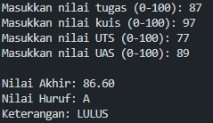

**Penjelasan Singkat:** Ada 4 langkah utama dalam program saya:
1. Memasukkan semua nilai
2. Memvalidasi input
3. Menghitung dan mengkonversi nilai akhir
4. Menentukan status akhir

### 2.2.1. Solusi Perulangan
Solusi diimplementasikan dalam Perulangan.java, dan di bawah ini adalah tangkapan layar hasilnya.

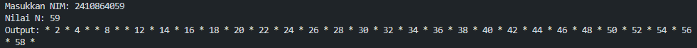 

**Penjelasan Singkat:** Ada 7 langkah utama dalam program saya:
1. Input Nilai NIM
2. Mengambil dua digit terakhir menggunakan fungsi substring dan mengubahnya menjadi Integer
3. Memeriksa apakah dua digit terakhir kurang dari 10, jika ya, tambahkan 10. 
4. Menyimpan hasilnya ke variabel N
5. Melakukan iterasi i dari 1 hingga N
6. Jika i adalah 6 atau 10, lewati iterasi
7. Jika i adalah bilangan ganjil, cetak "*". Jika tidak, cetak i

### 2.3.1 Solusi Array

Solusi diimplementasikan dalam Array.java, dan di bawah ini adalah tangkapan layar hasilnya.

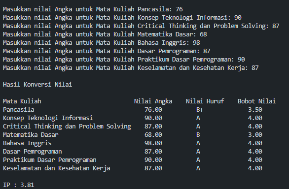 

**Penjelasan Singkat:** Ada 7 langkah utama dalam program saya:
1. Menginisialisasi array untuk menyimpan data mata kuliah
2. Memasukkan semua data mata kuliah
3. Memvalidasi nilai huruf
4. Mengkonversi nilai huruf ke GPA
5. Menyimpan dan mengakumulasi bobot SKS
6. Menghitung GPA
7. Menampilkan hasil

### 2.4.1 Solusi Fungsi

Solusi diimplementasikan dalam Fungsi.java, dan di bawah ini adalah tangkapan layar hasilnya.

 

**Penjelasan Singkat:** Ada 4 langkah utama dalam program saya:
1. Menginisialisasi data stok bunga
2. Menghitung pendapatan untuk setiap cabang
3. Menghitung total stok bunga
4. Menhitung stok bunga setelah pengurangan untuk setiap cabang

## 3. Tugas 

### 3.1 Solusi Tugas Pertama
Solusi diimplementasikan dalam Tugas1.java, dan di bawah ini adalah tangkapan layar hasilnya.

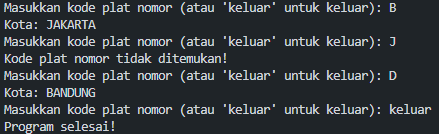 

**Penjelasan Singkat:** Ada 7 langkah dalam program saya:
1. Menginisialisasi kode plat nomor dan nama kota
2. Mengambil input dari pengguna
3. Mencari kode yang dimasukkan
\- [ Mencocokkan kode yang dimasukkan dengan setiap elemen array kode plat ]
5. Menampilkan kota yang sesuai
\- [ Menampilkan elemen array nama kota yang memiliki indeks yang sama dengan kode kota yang ditemukan ]
7. Menangani kode yang tidak valid
\- [ Jika langkah pencarian tidak menemukan kecocokan, cetak pesan kesalahan ]

### 3.2 Solusi Tugas Kedua
Solusi diimplementasikan dalam Tugas2.java, dan di bawah ini adalah tangkapan layar hasilnya.

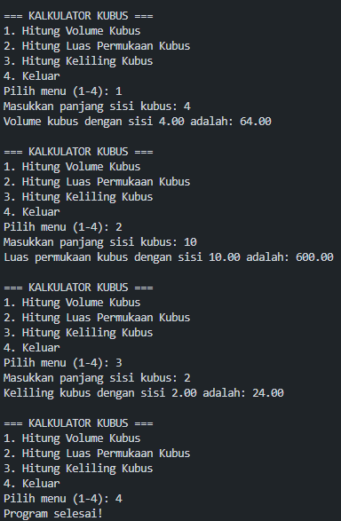 

**Penjelasan Singkat:** Ada 5 langkah utama dalam program saya:
1. Mendefinisikan fungsi matematika
\- Volume = sisi pangkat 3
\- Luas Permukaan = sisi * sisi * 6
\- Panjang Rusuk = sisi * 12
2. Menampilkan menu pilihan
\- Menghitung Volume 
\- Menghitung Luas Permukaan
\- Menghitung Panjang
4. Mengambil input pengguna dan memproses pilihan
5. Melakukan perhitungan yang sesuai
6. Keluar atau mengulang program

### 3.3 Tugas Ketiga
Solusi diimplementasikan dalam Tugas3.java, dan di bawah ini adalah tangkapan layar hasilnya.

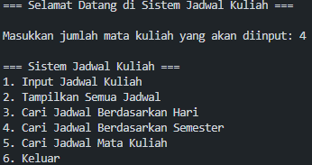
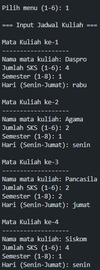
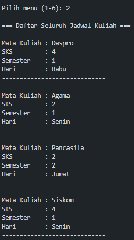
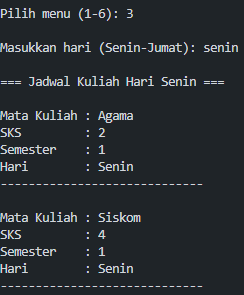
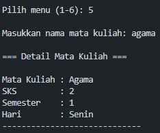
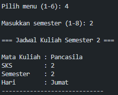

**Penjelasan Singkat:** Ada 7 langkah utama dalam program saya:
1. Menginisialisasi dan memasukkan data mata kuliah
2. Menampilkan menu untuk interaksi pengguna
3. Menampilkan semua data mata kuliah
4. Mencari mata kuliah berdasarkan kriteria
\- Berdasarkan Hari [ Mencocokkan string yang dimasukkan dengan setiap elemen array yang berisi data hari ]
\- Berdasarkan Semester [ Mencocokkan semester yang dimasukkan dengan setiap elemen array yang berisi data semester ]
\- Berdasarkan Nama Mata Kuliah [ Mencocokkan nama yang dimasukkan dengan setiap elemen array yang berisi data nama ]
5. Menangani pencarian yang tidak valid
\- [ Jika langkah pencarian tidak menemukan kecocokan, cetak pesan kesalahan ]
7. Keluar atau mengulang program
