|  | Algoritma dan Struktur Data |
|--|--|
| NIM |  244117020240|
| Nama | Mochammad Rijal Dzaki Rifki Afifudin |
| Kelas | TI - 1H |
| Repository | [Zinc-zn](https://github.com/Zinc-zn/14_ALSD) |

# Double Linked List

## 11 Praktikum

### 11.1 Percobaan 1

#### 11.1.1 Langkah Percobaan
Setelah melakukan langkah percobaan sesuai dengan petunjuk yang diberikan, dihasilkan 4 file, yaitu [Mahasiswa14.java](./Mahasiswa14.java), [Node14.java](./Node14.java), [DoubleLinkedList14,java](./DoubleLinkedList14.java), [DLLMain14.java](./DLLLMain14.java).

#### 11.1.3 Verifikasi Percobaan

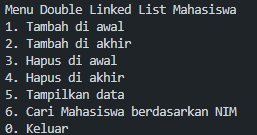
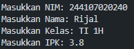

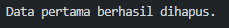
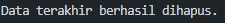
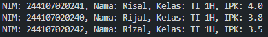
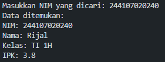


#### 11.1.3 Jawaban Pertanyaan

1. Perbedaan Single vs Double Linked List:

- Single Linked List: Setiap node hanya memiliki pointer ke node selanjutnya (next)
- Double Linked List: Setiap node memiliki pointer ke node selanjutnya (next) dan sebelumnya (prev)

2. Atribut next dan prev:

- next: Pointer yang menunjuk ke node selanjutnya dalam list
- prev: Pointer yang menunjuk ke node sebelumnya dalam list

3. Kegunaan konstruktor: Untuk menginisialisasi head dan tail menjadi null saat membuat object baru

4. Maksud kode addFirst(): Jika list kosong, node baru akan menjadi head sekaligus tail

5. Statement head.prev = newNode: Mengatur pointer prev dari head yang lama agar menunjuk ke node baru

6. Modifikasi print() untuk warning: Menambahkan pengecekan list kosong

7. Maksud insertAfter(): current.next.prev = newNode menghubungkan node setelah current dengan node baru

8. Modifikasi class [DLLMain14.java](./DLLLMain14.java) :
```
    case 7:
                    System.out.print("Masukkan NIM yang dicari: ");
                    String nim = scan.nextLine();
                    Node14 found = list.search(nim);
                    if (found != null) {
                        System.out.println("Data ditemukan:");
                        found.data.tampil();
                    } else {
                        System.out.println("Data tidak ditemukan.");
                    }
                    break;
```

```
    case 3:
                    System.out.print("Masukkan NIM setelah mana data akan disisipkan: ");
                    String nimKey = scan.nextLine();
                    Mahasiswa14 mhs3 = inputMahasiswa(scan);
                    list.insertAfter(nimKey, mhs3);
                    break;
```
menu :
```
    System.out.println("\nMenu Double Linked List Mahasiswa");
            System.out.println("1. Tambah di awal");
            System.out.println("2. Tambah di akhir");
            System.out.println("3. Tambah setelah NIM tertentu");
            System.out.println("4. Hapus di awal");
            System.out.println("5. Hapus di akhir");
            System.out.println("6. Tampilkan data");
            System.out.println("7. Cari Mahasiswa berdasarkan NIM");
            System.out.println("0. Keluar");
            System.out.print("Pilih menu: ");
```

### Note : Percobaan dua jadi satu pada percobaan 1

#### 11.2.3 Jawaban Pertanyaan
1. method removeFirst();
- head = head.next; → Menggeser head ke node selanjutnya (node kedua menjadi head baru)
- head.prev = null; → Mengatur pointer prev dari head yang baru menjadi null, karena head tidak memiliki node sebelumnya
2. Modifikasi class [DoubleLinkedList14,java](./DoubleLinkedList14.java) :

```
    Mahasiswa14 dataYangDihapus = head.data;
    Mahasiswa14 dataYangDihapus = tail.data;
```

```
    System.out.println("Data sudah berhasil dihapus.");
    System.out.println("Data yang terhapus adalah:");
```

```
    System.out.println("NIM: " + dataYangDihapus.nim + ", Nama: " + dataYangDihapus.nama + 
                  ", Kelas: " + dataYangDihapus.kelas + ", IPK: " + dataYangDihapus.ipk);
```


### 11.3 Tugas
Modifikasi program sebelumnya (percobaan 1 & percobaan 2), berikut adalah hasilnya :

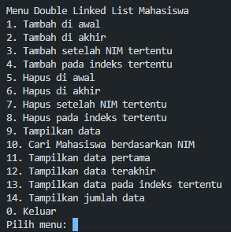
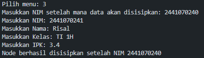
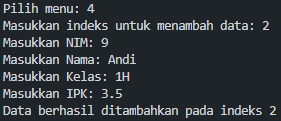
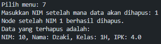
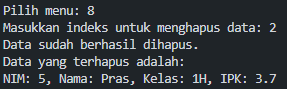
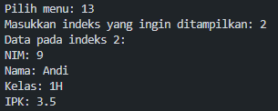
