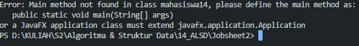
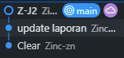
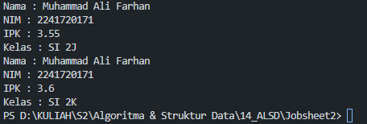
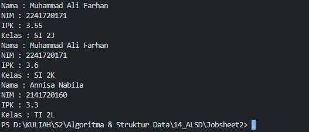
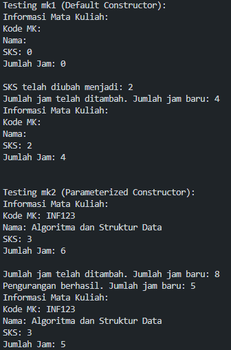
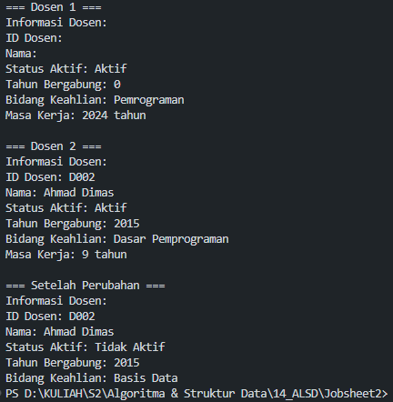

|  | Algoritma dan Struktur Data |
|--|--|
| NIM |  244107020240|
| Nama |  Mochammad Rijal Dzaki Rifki Afifudin |
| Kelas | TI - 1H |
| Repository | [Zinc-zn](https://github.com/) |


# Labs #2 Object

## 2. Praktikum

### 2.1.2 Verifikasi Hasil Percobaan 1

Percobaan 1 diimplementasikan dalam Mahasiswa14.java, dan di bawah ini adalah hasil dari percobaan 1



### 2.1.3 Jawaban Pertanyaan Percobaan 1
1. -   Encapsulation (Enkapsulasi): Class memiliki atribut dan method yang dibungkus menjadi satu kesatuan
	-   Inheritance (Pewarisan): Class dapat mewarisi sifat dari class lain
2. -   nama (String)
	-   nim (String)
	-   kelas (String)
	-   ipk (double)
3.  -   tampilkanInformasi() - untuk menampilkan informasi mahasiswa
    -   ubahKelas(String kelasBaru) - untuk mengubah kelas mahasiswa
    -   updateIpk(double ipkBaru) - untuk mengubah nilai IPK mahasiswa
    -   nilaiKinerja() - untuk menentukan kinerja berdasarkan IPK
4.  Memodifikasi method UpdateIpk()
```
void updateIpk(double ipkBaru) {
	if (ipkBaru >= 0.0 && ipkBaru <= 4.0) {
		ipk = ipkBaru;
		} else {
	    System.out.println("IPK tidak valid. Harus antara 0.0 dan 4.0");		
	 }
}
```

5. -   Method nilaiKinerja() berfungsi untuk mengevaluasi kinerja mahasiswa berdasarkan nilai IPK yang dimiliki.
	-   Kriteria yang digunakan untuk menentukan nilai kinerja:
    Jika IPK >= 3.5, maka kinerja dianggap "Kinerja sangat baik"
    Jika IPK >= 3.0 dan < 3.5, maka kinerja dianggap "Kinerja Baik"
    Jika IPK >= 2.0 dan < 3.0, maka kinerja dianggap "Kinerja cukup"
    Jika IPK < 2.0, maka kinerja dianggap "Kinerja kurang"
	-   Method nilaiKinerja() mengembalikan (return) nilai berupa String yang berisi kategori kinerja mahasiswa sesuai dengan kriteria di atas.
	6. Commit & Push
	

### 2.2.2. Verifikasi Hasil Percobaan 2
Percobaan 2 diimplementasikan dalam MahasiswaMain14.java, dan di bawah ini adalah hasil dari percobaan 2

 

### 2.2.3 Jawaban Pertanyaan Percobaan 2
1. ` mahasiswa14 mhs1 = new mahasiswa14();`
2. -   Atribut : `namaObjek.namaAtribut` Contoh: `mhs1.nama = "Muhammad Ali Farhan";`
	-  Method : `namaObjek.namaMethod(parameter)` Contoh: `mhs1.tampilkanInformasi();` atau `mhs1.updateIpk(3.60);`
3.  Pemanggilan pertama dan kedua :
	-   Pemanggilan pertama, tampilkanInformasi() menampilkan data awal mhs1 dengan nilai:
	    -   nama: "Muhammad Ali Farhan"
	    -   nim: "2241720171"
	    -   kelas: "SI 2J"
	    -   ipk: 3.55
	-   Setelah pemanggilan pertama, dilakukan perubahan pada objek mhs1 melalui method:
	    -   ubahKelas("SI 2K") yang mengubah kelas menjadi "SI 2K"
	    -   updateIpk(3.60) yang mengubah IPK menjadi 3.60

### 2.3.2 Verifikasi Hasil Percobaan 3

Percobaan 3 diimplementasikan dalam MahasiswaMain14.java, dan di bawah ini adalah hasil dari percobaan 3

 

### 2.3.3 Jawaban Pertanyaan Percobaan 3

1. ```
	public mahasiswa14 (String nm, String nim, double ipk, String kls) {
	    nama = nm;
	    this.nim = nim;
	    this.ipk = ipk;
	    kelas = kls;
    } 
    ```
 2. Membuat objek baru dari class mahasiswa14 dengan menggunakan konstruktor berparameter. Objek tersebut langsung diinisialisasi dengan nilai "Annisa Nabila" untuk nama, "2141720160" untuk NIM, 3.25 untuk IPK, dan "TI 2L" untuk kelas. \
 3.  Jika konstruktor default (`public mahasiswa14(){}`) dihapus dari class Mahasiswa, program akan error saat kompilasi. Ini terjadi karena pada MahasiswaMain ada pemanggilan `mahasiswa14 mhs1 = new mahasiswa14();` yang membutuhkan konstruktor default.

     
   
 4. -   Method dalam class dapat dipanggil sesuai kebutuhan dan dalam urutan apapun setelah object dibuat
	-   Urutan pemanggilan method ditentukan oleh kebutuhan program, bukan oleh urutan deklarasi method dalam class
	-   Object yang sudah diinstansiasi memiliki semua method yang siap digunakan kapan saja selama object tersebut masih ada
	
5. `mahasiswa14 mhs = new mahasiswa14("Ahmad Rizky", "2241720180", 3.85, "SI 2F");` 
`mhs14.tampilkanInformasi();`

6. Commit & Push


### 2.4 Solusi Tugas Pertama
Solusi diimplementasikan dalam MataKuliah14.java, dan MataKuliahMain14.java. di bawah ini adalah tangkapan layar hasilnya.

 

**Penjelasan Singkat:** 
1.  Atribut :
-    `kodeMK`: String untuk menyimpan kode mata kuliah
-   `nama`: String untuk menyimpan nama mata kuliah
-   `sks`: Integer untuk menyimpan jumlah SKS (Satuan Kredit Semester)
-   `jumlahJam`: Integer untuk menyimpan total jam perkuliahan  
2. Konstruktor :
-   Konstruktor default: Menginisialisasi semua atribut dengan nilai kosong atau nol
-   Konstruktor berparameter: Menginisialisasi atribut dengan nilai yang diberikan
3. Method : 
-   `tampilInformasi()`: Menampilkan semua informasi mata kuliah ke konsol
-   `ubahSKS(int sksBaru)`: Mengubah nilai SKS dan menampilkan konfirmasi
-   `tambahJam(int jam)`: Menambah jumlah jam dan menampilkan jumlah jam baru
-   `kurangiJam(int jam)`: Mengurangi jumlah jam dengan validasi agar tidak menjadi negatif
4. Pembuatan Objek :
  -   `mk1`: Objek MataKuliah14 dibuat menggunakan konstruktor default (tanpa parameter)
  -   `mk2`: Objek MataKuliah14 dibuat menggunakan konstruktor berparameter dengan nilai "INF123", "Algoritma dan Struktur Data", 3 SKS, dan 6 jam
5.  Pengujian mk1 :
   -   Menampilkan informasi awal mk1 (semua nilai default)
	-   Mengubah SKS menjadi 2
  -   Menambahkan 4 jam ke jumlah jam
  -   Menampilkan kembali informasi mk1 setelah perubahan
6.  Pengujian mk2 :
   -   Menampilkan informasi awal mk2 (nilai sesuai parameter)
   -   Menambahkan 2 jam ke jumlah jam
   -   Mengurangi 3 jam dari jumlah jam
   -   Menampilkan kembali informasi mk2 setelah perubahan

### 2.4 Solusi Tugas Kedua
Solusi diimplementasikan dalam Dosen14.java, dan DosenMain14.java. di bawah ini adalah tangkapan layar hasilnya.

 

**Penjelasan Singkat:** :
Class Dosen14:
1.  Atribut: Memiliki 5 atribut - idDosen, nama, statusAktif, tahunBergabung, dan bidangKeahlian.
2.  Konstruktor: Memiliki 2 konstruktor:
    -   Konstruktor default yang menginisialisasi nilai default
    -   Konstruktor berparameter untuk inisialisasi semua atribut
3.  Method:
    -   `tampilInformasi()`: Menampilkan semua informasi dosen
    -   `setStatusAktif()`: Mengubah status keaktifan dosen
    -   `hitungMasaKerja()`: Menghitung lama kerja dosen berdasarkan tahun saat ini
    -   `ubahKeahlian()`: Mengubah bidang keahlian dosen
    
Class DosenMain14:

1.  Main Method: Berisi fungsi utama yang menjalankan program
2.  Implementasi:
    -   Membuat objek `dosen1` menggunakan konstruktor default, kemudian mengubah status dan keahliannya
    -   Membuat objek `dosen2` menggunakan konstruktor berparameter dengan nilai tertentu
    -   Menampilkan informasi kedua dosen termasuk masa kerja
    -   Mengubah status dan keahlian `dosen2` dan menampilkan informasi setelah perubahan