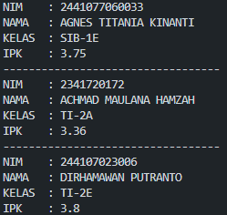
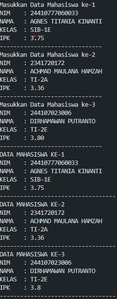
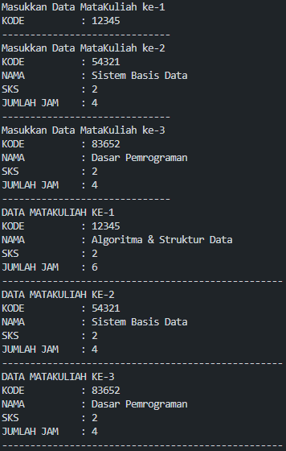
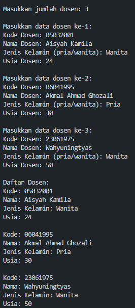
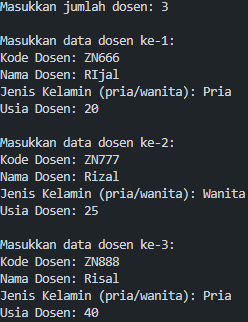
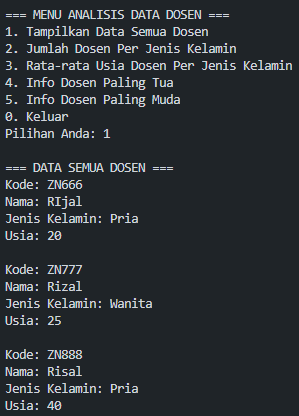
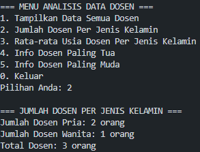
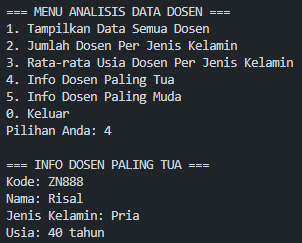
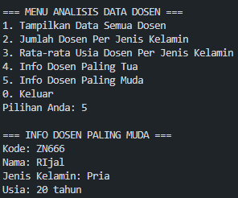
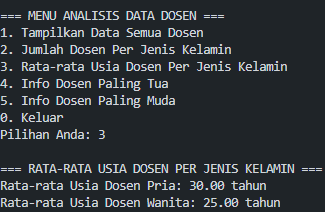

|  | Algoritma dan Struktur Data |
|--|--|
| NIM |  244107020240|
| Nama |  Mochammad Rijal Dzaki Rifki Afifudin |
| Kelas | TI - 1H |
| Repository | [Zinc-zn](https://github.com/) |


# Labs #3 Array Of Object

## 3. Praktikum

### 3.2.2 Verifikasi Hasil Percobaan 1

Percobaan 1 diimplementasikan dalam Mahasiswa14.java & MahawiswaDemo14.java, dan di bawah ini adalah hasil dari percobaan 1



### 3.2.3 Jawaban Pertanyaan Percobaan 1
1.    Tidak, class yang akan dibuat array of object tidak harus selalu memiliki atribut dan method. Sebuah class dapat hanya memiliki atribut saja, method saja, atau bahkan tidak memiliki keduanya
2. Melakukan deklarasi dan pembuatan array yang dapat menampung 3 objek dari class Mahasiswa.
3.  Java secara otomatis menyediakan konstruktor default (tanpa parameter) jika tidak ada konstruktor yang didefinisikan dalam class. Konstruktor default ini tidak melakukan apa-apa selain menciptakan objek kosong dengan nilai default untuk semua atribut (null untuk String dan 0.0 untuk float).
4.  1.    Membuat objek Mahasiswa baru dan menyimpannya ke elemen pertama (index 0) dari array arrayOfMahasiswa
	 2.   Mengisi atribut-atribut dari objek Mahasiswa tersebut dengan nilai-nilai : 		    
			 -  nim diisi dengan "24410760033"
		    -   nama diisi dengan "AGNES TITANIA KINANTI"
		    -   kelas diisi dengan "SIB-1E"
		    -   ipk diisi dengan 3.75 (dikonversi ke tipe data float)
5. -   Class Mahasiswa berfungsi sebagai blueprint/template untuk objek yang menyimpan data mahasiswa (model)
	-   Class MahasiswaDemo berfungsi sebagai program utama (main class) yang mendemonstrasikan penggunaan class Mahasiswa


### 3.3.2 Verifikasi Hasil Percobaan 2

Percobaan 2 diimplementasikan dalam Mahasiswa14.java & MahasiswaDemo14.java, dan di bawah ini adalah hasil dari percobaan 2

 

### 3.3.3 Jawaban Pertanyaan Percobaan 2

1.  Method cetakInfo() :
```
	public  MataKuliah14(String  kode, String  nama, int  sks, int  jumlahJam) {
	this.kode  =  kode;
	this.nama  =  nama;
	this.sks  =  sks;
	this.jumlahJam  =  jumlahJam;
} 
```
Modifikasi method main() :
```
for (int i = 0; i < 3; i++) {
    System.out.println("DATA MAHASISWA KE-" + (i+1));
    arrayOfMahasiswa14[i].cetakInfo(); // Panggil method cetakInfo() untuk menampilkan data
}
```
 2. -   Array `myArrayOfMahasiswa` dibuat dengan ukuran 3, tetapi setiap elemen di dalam array masih berisi `null` (belum diinisialisasi sebagai objek Mahasiswa).
	-   Ketika mencoba mengakses properti `nim`, `nama`, `kelas`, dan `ipk` pada `myArrayOfMahasiswa[0]`, program akan menghasilkan `NullPointerException` karena mencoba mengakses properti dari objek yang masih `null`
	- Solusi :
```
	Mahasiswa[] myArrayOfMahasiswa = new Mahasiswa[3];
	myArrayOfMahasiswa[0] = new Mahasiswa();
	myArrayOfMahasiswa[0].nim = "244107060033";
	myArrayOfMahasiswa[0].nama = "AGNES TITANIA KINANTI";
	myArrayOfMahasiswa[0].kelas = "SIB-1E";
	myArrayOfMahasiswa[0].ipk = (float) 3.75;
``` 

### 3.4.2 Verifikasi Hasil Percobaan 3

Percobaan 3 diimplementasikan dalam MataKuliah14.java & MataKuliahDemo14.java, dan di bawah ini adalah hasil dari percobaan 3

 

### 3.4.3 Jawaban Pertanyaan Percobaan 3

1.  Constructor lengkap :
```
	public  MataKuliah14(String kode,  String nama,  int sks,  int jumlahJam)  { 
		this.kode = kode; 
		this.nama = nama; 
		this.sks = sks; 
		this.jumlahJam = jumlahJam; 
	}
```
Constructor tanpa jumlah jam :
```
public  MataKuliah14(String kode,  String nama,  int sks)  { 
	this.kode = kode; 
	this.nama = nama; 
	this.sks = sks; 
	this.jumlahJam = sks *  2;
}
```
Constructor tanpa parameter :
```
public  MataKuliah14()  { 
	this.kode =  "DEFAULT"; 
	this.nama =  "Mata Kuliah Default"; 
	this.sks =  0; 
	this.jumlahJam =  0; 
}
```
 2. Method tambahData() :
 ```
public  void  tambahData(String kode,  String nama,  int sks,  int jumlahJam)  { 
	this.kode = kode; 
	this.nama = nama; 
	this.sks = sks; 
	this.jumlahJam = jumlahJam; 
}
```
Modifikasi main() :
```
// inisialisasi objek
arrayOfMataKuliah14[i] =  new  MataKuliah14("", "", 0, 0);
// memanggil method tambahData()
arrayOfMataKuliah14[i].tambahData(kode, nama, sks, jumlahJam);
```
3. Method cetakInfo() :
```
public  void  cetakInfo()  { 
	System.out.println("KODE : "  +  this.kode); 
	System.out.println("NAMA : "  +  this.nama); 
	System.out.println("SKS : "  +  this.sks); 
	System.out.println("JUMLAH JAM : "  +  this.jumlahJam); 		
	System.out.println("-----------------------------------------------"); 
}
```
Modifikasi main () :
```
// Memanggil method cetakInfo()
for  (int i =  0; i <  3; i++)  {
 System.out.println("DATA MATAKULIAH KE-"+  (i+1));
 arrayOfMataKuliah14[i].cetakInfo(); }
```
4. Modifikasi main() :
```
System.out.print("Masukkan jumlah mata kuliah: ");
String  input  =  sc.nextLine();
int  jumlahMataKuliah  =  Integer.parseInt(input);
```
### 3.5 Jawaban Tugas Pertama & Kedua
Jawaban diimplementasikan dalam Dosen14.java, DosenDemo14.java, dan DataDosen14.java. di bawah ini adalah tangkapan layar hasilnya.

Jawaban Tugas 1

 

Jawaban tugas 2 

Menambah data dosen

 

Menampilkan semua data dosen

 

Menampilkan data dosen setiap jenis kelamin

 

Menampilkan data dosen paling tua

 

Menampilkan data dosen paling muda

 

Menampilkan data rata rata usia dosen

 


