|  | Algoritma dan Struktur Data |
|--|--|
| NIM |  244107020240|
| Nama | Mochammad Rijal Dzaki Rifki Afifudin |
| Kelas | TI - 1H |
| Repository | [Zinc-zn](https://github.com/Zinc-zn/14_ALSD) |

# Queue

## 9 Praktikum

### 9.1 Operasi Dasar Queue

#### 9.1.1 Langkah Percobaan
Setelah melakukan langkah percobaan sesuai dengan petunjuk yang diberikan, dihasilkan 2 file, yaitu [Queue14.java](./Queue14.java), [QueueMain14.java](./QueueMain14.java).

#### 9.1.3 Verifikasi Percobaan

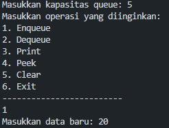

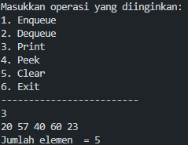
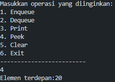
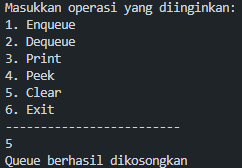
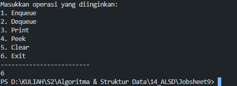

#### 9.1.3 Jawaban Pertanyaan

1. Nilai awal front dan rear diset ke -1 untuk menandakan bahwa queue dalam keadaan kosong. Ketika nilai front dan rear adalah -1, ini mengindikasikan bahwa belum ada indeks array yang valid untuk elemen pertama maupun terakhir.
Sedangkan size diinisialisasi dengan nilai 0 karena memang belum ada elemen dalam queue.
2. Ketika rear sudah berada di posisi terakhir array (indeks max-1), maka nilai rear akan diatur kembali ke 0. Ini memungkinkan queue untuk terus menggunakan ruang kosong di bagian depan array jika ada elemen yang sudah di-dequeue.
3. Ketika front sudah berada di posisi terakhir array (indeks max-1), maka nilai front akan diatur kembali ke 0 setelah elemen tersebut di-dequeue.
4. Dengan memulai perulangan dari i=front, metode print akan mencetak elemen-elemen queue sesuai dengan urutan masuknya, dimulai dari elemen yang paling dulu masuk (yang berada di posisi front) hingga elemen yang terakhir masuk (yang berada di posisi rear).
5. Kode ini memastikan bahwa indeks i akan kembali ke 0 setelah mencapai max-1.
Penggunaan operator modulus (%) memungkinkan indeks i untuk kembali ke 0 ketika melewati batas maksimum array, sehingga perulangan dapat berjalan secara melingkar.
6. `     int dt = 0;
    if (IsEmpty()) {
        System.out.println("Queue underflow! Program dihentikan.");
        System.exit(1);
    } else {
        dt = data[front];
        size--;
        if(IsEmpty()) {
            front = rear = -1;
        } else {
            if (front == max -1) {
                front = 0;
            } else {
                front++;
            }
        }
    }
    return dt;
}
`
7. Modifikasi Method Enqueue pada class [Queue14.java](./Queue14.java) :
```
public void Enqueue (int dt) {
    if (IsFull()) {
        System.out.println("Queue overflow! Program dihentikan.");
        System.exit(1);
    } else {
        if (IsEmpty()) {
            front = rear = 0;
        } else {
            if (rear == max -1) {
                rear = 0;
            } else {
                rear++;
            }
        }
        data[rear] = dt;
        size++;
    }
}
```
Modifikasi Method Dequeu pada class [Queue14.java](./Queue14.java) :
```
public int Dequeue() {
    int dt = 0;
    if (IsEmpty()) {
        System.out.println("Queue underflow! Program dihentikan.");
        System.exit(1);
        return -1;
    } else {
        dt = data[front];
        size--;
        if(IsEmpty()) {
            front = rear = -1;
        } else {
            if (front == max -1) {
                front = 0;
            } else {
                front++;
            }
        }
    }
    return dt;
}
```


### 9.2 Antrian Layanan Akademik

#### 9.2.1 Langkah Percobaan
Setelah melakukan langkah percobaan sesuai dengan petunjuk yang diberikan, dihasilkan 2 file, yaitu [Mahasiswa14.java](./Mahasiswa14.java), dan [LayananAkademiSiakad14.java](./LayananAkademiSiakad14.java).

#### 9.2.2 Verifikasi Percobaan
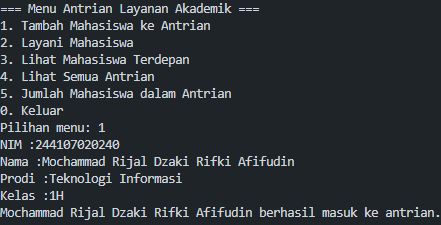
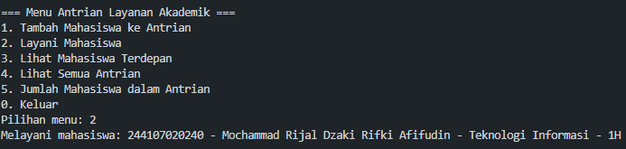
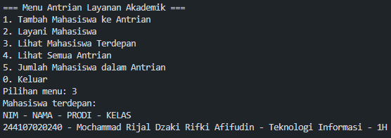
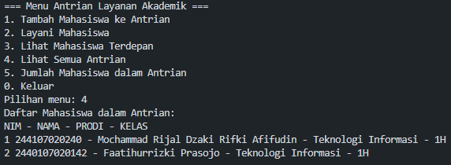
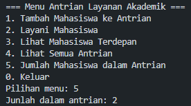
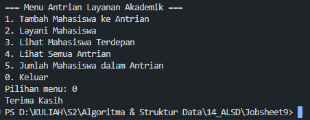

#### 9.2.3 Jawaban Pertanyaan
1. Menambahkan Method lihatAkhir pada class [Mahasiswa14.java](./Mahasiswa14.java) :
```
public void lihatAkhir() {
    if (IsEmpty()) {
        System.out.println("Antrian kosong.");
    } else {
        System.out.println("Mahasiswa paling belakang: ");
        System.out.println("NIM - NAMA - PRODI - KELAS");
        data[rear].tampilkanData();
    }
}
```
Menambahkan menu 6 pada [LayananAkademiSiakad14.java](./LayananAkademiSiakad14.java) :
```
case 6:
    antrian.lihatAkhir();
    break;
```


### 9.3 Tugas
Program di implementasikan pada 3 class, yaitu :   
 [MahasiswaKRS14.java](./MahasiswaKRS14.java), [AntrianKRS14.java](./AntrianKRS14.java), dan [KRSMain14.java](./KRSMain14.java).

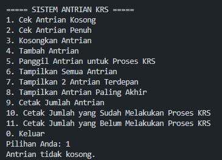
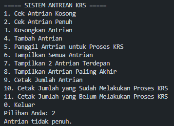

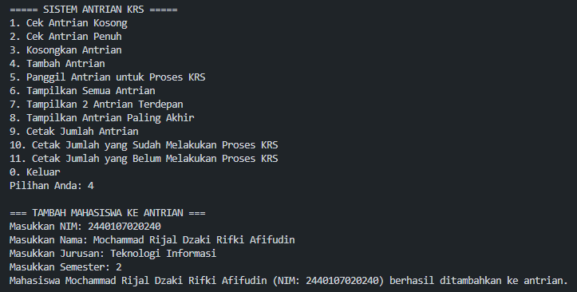
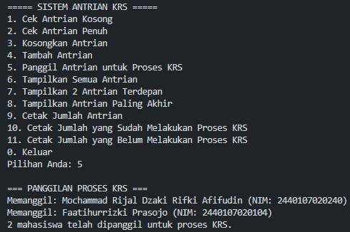
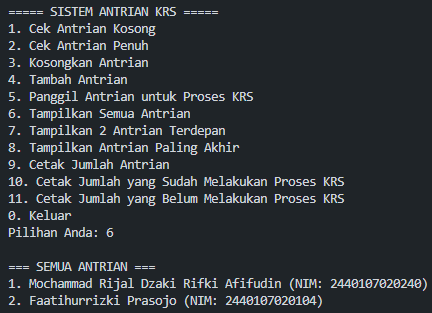
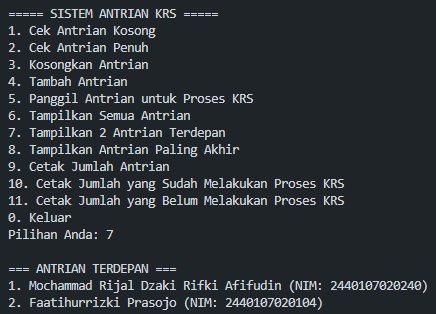
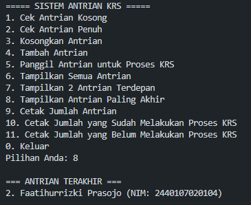
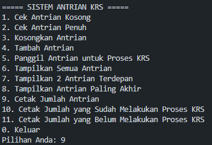
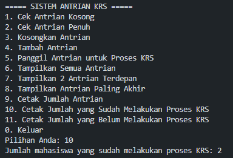
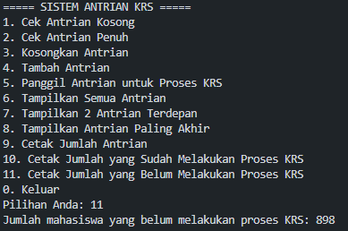
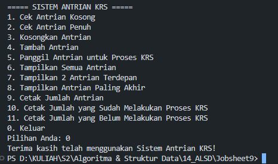